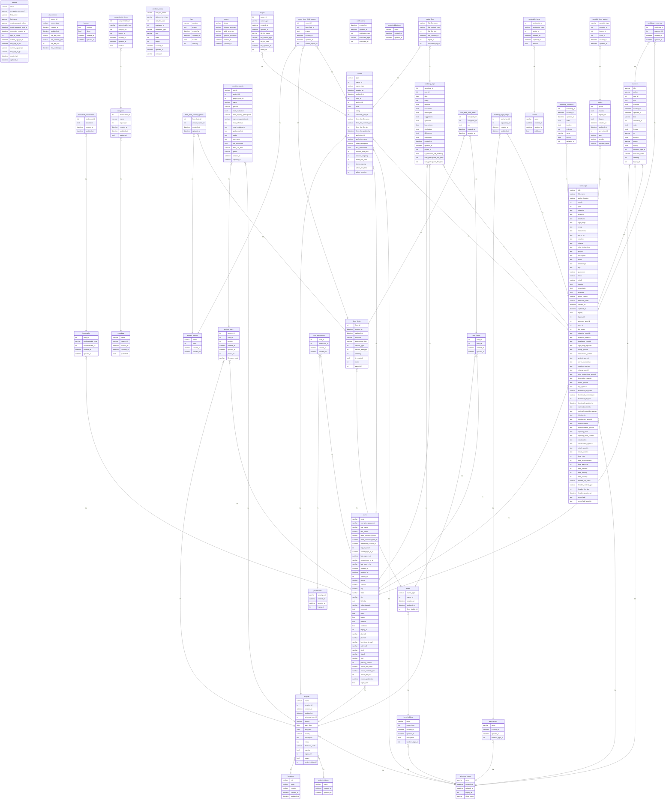

```mermaid
erDiagram
  admins {
    varchar email
    varchar encrypted_password
    varchar first_name
    varchar last_name
    varchar reset_password_token
    datetime reset_password_sent_at
    datetime remember_created_at
    int sign_in_count
    datetime current_sign_in_at
    datetime last_sign_in_at
    varchar current_sign_in_ip
    varchar last_sign_in_ip
    datetime created_at
    datetime updated_at
  }
  age_ranges {
    varchar name
    datetime created_at
    datetime updated_at
    int windows_type_id
  }
  answer_options {
    varchar name
    int order
    datetime created_at
    datetime updated_at
  }
  attachments {
    int owner_id
    varchar owner_type
    datetime created_at
    datetime updated_at
    varchar file_file_name
    varchar file_content_type
    int file_file_size
    datetime file_updated_at
  }
  banners {
    text content
    bool show
    datetime created_at
    datetime updated_at
  }
  bookmark_annotations {
    int bookmark_id
    text annotation
    datetime created_at
    datetime updated_at
  }
  bookmarks {
    int user_id
    varchar bookmarkable_type
    int bookmarkable_id
    datetime created_at
    datetime updated_at
  }
  categories {
    int metadatum_id
    varchar name
    int legacy_id
    datetime created_at
    datetime updated_at
    bool published
  }
  categorizable_items {
    int categorizable_id
    varchar categorizable_type
    int category_id
    int legacy_id
    datetime created_at
    datetime updated_at
    bool inactive
  }
  ckeditor_assets {
    varchar data_file_name
    varchar data_content_type
    int data_file_size
    int assetable_id
    varchar assetable_type
    varchar type
    int width
    int height
    datetime created_at
    datetime updated_at
    varchar actual_url
  }
  faqs {
    varchar question
    text answer
    datetime created_at
    datetime updated_at
    bool inactive
    int ordering
  }
  footers {
    varchar phone
    varchar children_program
    varchar adult_program
    varchar general_questions
    datetime created_at
    datetime updated_at
  }
  form_builders {
    varchar name
    int owner_type
    datetime created_at
    datetime updated_at
    text description
    int windows_type_id
  }
  form_field_answer_options {
    int form_field_id
    int answer_option_id
    datetime created_at
    datetime updated_at
  }
  form_fields {
    int form_id
    datetime created_at
    datetime updated_at
    varchar question
    varchar instructional_hint
    int answer_type
    int answer_datatype
    int ordering
    bool is_required
    int status
    int parent_id
  }
  forms {
    varchar owner_type
    int owner_id
    datetime created_at
    datetime updated_at
    int form_builder_id
  }
  images {
    int owner_id
    varchar owner_type
    datetime created_at
    datetime updated_at
    varchar file_file_name
    varchar file_content_type
    int file_file_size
    datetime file_updated_at
    int report_id
  }
  locations {
    varchar city
    varchar state
    varchar country
    datetime created_at
    datetime updated_at
  }
  media_files {
    varchar file_file_name
    varchar file_content_type
    int file_file_size
    datetime file_updated_at
    int report_id
    int workshop_log_id
  }
  metadata {
    varchar name
    varchar legacy_id
    datetime created_at
    datetime updated_at
    bool published
  }
  monthly_reports {
    varchar month
    int project_id
    int project_user_id
    varchar name
    varchar position
    bool mail_evaluations
    varchar num_ongoing_participants
    varchar num_new_participants
    text most_effective
    text most_challenging
    text goals_reached
    text goals
    text comments
    bool call_requested
    varchar best_call_time
    varchar phone
    datetime created_at
    datetime updated_at
  }
  notifications {
    datetime created_at
    datetime updated_at
    int notification_type
    varchar noticeable_type
    int noticeable_id
  }
  permissions {
    varchar security_cat
    datetime created_at
    datetime updated_at
    int legacy_id
  }
  project_obligations {
    varchar name
    datetime created_at
    datetime updated_at
  }
  project_statuses {
    varchar name
    datetime created_at
    datetime updated_at
  }
  project_users {
    int agency_id
    int user_id
    int position
    datetime created_at
    datetime updated_at
    int project_id
    varchar filemaker_code
  }
  projects {
    varchar name
    int location_id
    datetime created_at
    datetime updated_at
    int windows_type_id
    varchar district
    date start_date
    date end_date
    varchar locality
    text description
    text notes
    varchar filemaker_code
    bool inactive
    int legacy_id
    bool legacy
    int project_status_id
  }
  quotable_item_quotes {
    varchar quotable_type
    int quotable_id
    int legacy_id
    int quote_id
    datetime created_at
    datetime updated_at
  }
  quotes {
    text quote
    bool inactive
    int legacy_id
    bool legacy
    datetime created_at
    datetime updated_at
    int workshop_id
    varchar age
    varchar gender
    varchar speaker_name
  }
  report_form_field_answers {
    int report_id
    int form_field_id
    text answer
    datetime created_at
    datetime updated_at
    int answer_option_id
  }
  reports {
    varchar type
    int owner_id
    varchar owner_type
    datetime created_at
    datetime updated_at
    int user_id
    int project_id
    date date
    int rating
    int windows_type_id
    varchar form_file_file_name
    varchar form_file_content_type
    int form_file_file_size
    datetime form_file_updated_at
    int workshop_id
    varchar workshop_name
    varchar other_description
    bool has_attachment
    int children_first_time
    int children_ongoing
    int teens_first_time
    int teens_ongoing
    int adults_first_time
    int adults_ongoing
  }
  resources {
    varchar title
    varchar author
    int user_id
    text text
    bool featured
    datetime created_at
    datetime updated_at
    varchar kind
    int workshop_id
    bool male
    bool female
    varchar url
    bool inactive
    varchar agency
    bool legacy
    int windows_type_id
    varchar filemaker_code
    int ordering
    int legacy_id
  }
  sectorable_items {
    int sectorable_id
    varchar sectorable_type
    int sector_id
    datetime created_at
    datetime updated_at
    bool inactive
  }
  sectors {
    varchar name
    datetime created_at
    datetime updated_at
    bool published
  }
  user_form_form_fields {
    int form_field_id
    int user_form_id
    text text
    datetime created_at
    datetime updated_at
  }
  user_forms {
    int user_id
    int form_id
    datetime created_at
    datetime updated_at
  }
  user_permissions {
    int user_id
    int permission_id
    datetime created_at
    datetime updated_at
  }
  users {
    varchar email
    varchar encrypted_password
    varchar first_name
    varchar last_name
    varchar reset_password_token
    datetime reset_password_sent_at
    datetime remember_created_at
    int sign_in_count
    datetime current_sign_in_at
    datetime last_sign_in_at
    varchar current_sign_in_ip
    varchar last_sign_in_ip
    datetime created_at
    datetime updated_at
    int agency_id
    varchar phone
    varchar address
    varchar city
    varchar state
    varchar zip
    date birthday
    varchar subscribecode
    text comment
    text notes
    bool legacy
    bool inactive
    bool confirmed
    int legacy_id
    varchar phone2
    varchar phone3
    varchar best_time_to_call
    varchar address2
    varchar city2
    varchar state2
    varchar zip2
    int primary_address
    varchar avatar_file_name
    varchar avatar_content_type
    int avatar_file_size
    datetime avatar_updated_at
    bool super_user
  }
  windows_types {
    varchar name
    datetime created_at
    datetime updated_at
    int legacy_id
    varchar short_name
  }
  workshop_age_ranges {
    int workshop_id
    int age_range_id
    datetime created_at
    datetime updated_at
  }
  workshop_logs {
    int workshop_id
    int user_id
    date date
    int rating
    text reaction
    text successes
    text challenges
    text suggestions
    text questions
    bool lead_similar
    text similarities
    text differences
    text comments
    datetime created_at
    datetime updated_at
    int project_id
    bool is_embodied_art_workshop
    int num_participants_on_going
    int num_participants_first_time
  }
  workshop_resources {
    int workshop_id
    int resource_id
    datetime created_at
    datetime updated_at
  }
  workshop_variations {
    int workshop_id
    datetime created_at
    datetime updated_at
    text code
    bool inactive
    int ordering
    varchar name
    bool legacy
    int variation_id
  }
  workshops {
    varchar title
    varchar full_name
    varchar author_location
    int month
    int year
    text objective
    text materials
    text timeframe
    text age_range
    text setup
    text instructions
    text warm_up
    text creation
    text closing
    text misc_instructions
    text project
    text description
    text notes
    text timestamps
    text tips
    varchar pub_issue
    varchar misc1
    varchar misc2
    bool inactive
    bool searchable
    bool featured
    varchar photo_caption
    varchar filemaker_code
    datetime created_at
    datetime updated_at
    bool legacy
    int legacy_id
    int windows_type_id
    int user_id
    int led_count
    text objective_spanish
    text materials_spanish
    text timeframe_spanish
    text age_range_spanish
    text setup_spanish
    text instructions_spanish
    text project_spanish
    text warm_up_spanish
    text creation_spanish
    text closing_spanish
    text misc_instructions_spanish
    text description_spanish
    text notes_spanish
    text tips_spanish
    varchar thumbnail_file_name
    varchar thumbnail_content_type
    int thumbnail_file_size
    datetime thumbnail_updated_at
    text optional_materials
    text optional_materials_spanish
    text introduction
    text introduction_spanish
    text demonstration
    text demonstration_spanish
    text opening_circle
    text opening_circle_spanish
    text visualization
    text visualization_spanish
    text misc1_spanish
    text misc2_spanish
    int time_intro
    int time_demonstration
    int time_warm_up
    int time_creation
    int time_closing
    int time_opening
    varchar header_file_name
    varchar header_content_type
    int header_file_size
    datetime header_updated_at
    text extra_field
    text extra_field_spanish
  }
  age_ranges }o--|| windows_types : FK
  bookmark_annotations }o--|| bookmarks : FK
  bookmarks }o--|| users : FK
  categories }o--|| metadata : FK
  categorizable_items }o--|| categories : FK
  form_builders }o--|| windows_types : FK
  form_field_answer_options }o--|| answer_options : FK
  form_field_answer_options }o--|| form_fields : FK
  form_fields }o--|| forms : FK
  forms }o--|| form_builders : FK
  images }o--|| reports : FK
  media_files }o--|| reports : FK
  media_files }o--|| workshop_logs : FK
  monthly_reports }o--|| project_users : FK
  monthly_reports }o--|| projects : FK
  project_users }o--|| projects : FK
  project_users }o--|| users : FK
  projects }o--|| locations : FK
  projects }o--|| project_statuses : FK
  projects }o--|| windows_types : FK
  quotable_item_quotes }o--|| quotes : FK
  quotes }o--|| workshops : FK
  report_form_field_answers }o--|| answer_options : FK
  report_form_field_answers }o--|| form_fields : FK
  report_form_field_answers }o--|| reports : FK
  reports }o--|| projects : FK
  reports }o--|| users : FK
  reports }o--|| windows_types : FK
  reports }o--|| workshops : FK
  resources }o--|| users : FK
  resources }o--|| windows_types : FK
  resources }o--|| workshops : FK
  sectorable_items }o--|| sectors : FK
  user_form_form_fields }o--|| form_fields : FK
  user_form_form_fields }o--|| user_forms : FK
  user_forms }o--|| forms : FK
  user_forms }o--|| users : FK
  user_permissions }o--|| permissions : FK
  user_permissions }o--|| users : FK
  users }o--|| projects : FK
  workshop_age_ranges }o--|| age_ranges : FK
  workshop_age_ranges }o--|| workshops : FK
  workshop_logs }o--|| projects : FK
  workshop_logs }o--|| users : FK
  workshop_logs }o--|| workshops : FK
  workshop_resources }o--|| resources : FK
  workshop_resources }o--|| workshops : FK
  workshop_variations }o--|| workshops : FK
  workshops }o--|| users : FK
  workshops }o--|| windows_types : FK
```